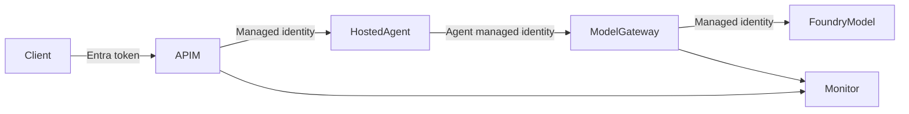
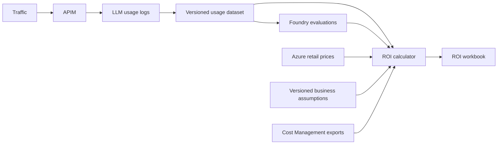
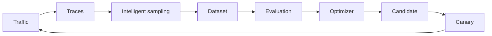

# New Lab Ideas

This document proposes follow-up labs that build on the GitHub Copilot BYOK and Microsoft Foundry Hosted Agents with Custom Frameworks labs. The ideas progress from securing hosted agents to governing, evaluating, and operating them in production.

## Recommended Next Lab

### `hosted-agent-zero-trust`

**Goal:** Run a custom-framework Hosted Agent without storing an APIM subscription key in the agent container.

This lab would demonstrate:

- Entra authentication for clients
- Per-user or per-group agent authorization
- Hosted Agent identity calling the model gateway
- No API keys in container environment variables
- Per-user and per-agent token limits
- End-to-end correlation IDs
- Chargeback by user, agent, framework, and model
- A bypass test proving direct model access is rejected
- PydanticAI and Strands implementations using the same identity pattern

This is the most natural progression because it closes the main security gap in the Custom Frameworks lab while reusing the strongest parts of the BYOK lab.

## Other Strong Ideas

### 1. `hosted-agent-canary-deployment`

Deploy multiple versions of an agent and use APIM for:

- Percentage-based traffic splitting
- Header-based preview routing
- Automatic fallback when a version fails
- Per-version latency, token, error, and quality metrics
- Promotion and rollback workflows

This lab would teach agent lifecycle management rather than only initial deployment.

### 2. `agent-framework-evaluations`

Deploy equivalent Strands and PydanticAI agents, then compare them using Microsoft Foundry evaluations:

- Task completion
- Tool-call accuracy
- Groundedness
- Safety
- Latency
- Token usage and estimated cost
- Streaming behavior

APIM could route requests using an `x-agent-framework` header and emit comparable telemetry for both implementations.

### 3. `agent-finops-governance`

Extend the BYOK workbook and metering approach from models to agents:

- Cost by user, agent, version, framework, tool, and model
- Per-agent budgets
- Token quotas
- Cached-token accounting
- Tool invocation costs
- Budget alerts and request rejection
- Requested agent versus actually served version

This lab would address the additional cost-attribution complexity introduced by multi-step agent execution.

### 4. `agent-prompt-injection-defense`

Build an agent with deliberately unsafe tools, then progressively secure it:

- Indirect prompt-injection detection
- Tool allowlists
- Tool argument validation
- Sensitive environment-variable protection
- Output filtering
- Human approval for high-impact tools
- Managed-identity scope restrictions
- Security telemetry through APIM

The environment-variable debugging tool in the current Strands sample provides a concrete example of the risk this lab could explain and remediate.

### 5. `multi-tenant-agent-gateway`

Expose shared Hosted Agents safely to multiple teams or customers:

- Tenant identification from Entra claims
- Tenant-to-agent authorization
- Separate quotas and budgets
- Tenant-specific system instructions or model selection
- Data and telemetry isolation
- Per-tenant throttling
- Tenant-aware chargeback

This lab would move the Hosted Agents scenario toward a realistic SaaS architecture.

### 6. `hosted-agent-private-connectivity`

Create a fully private version of the Custom Frameworks lab:

- Private ACR image pulls
- Private Microsoft Foundry endpoints
- APIM virtual-network integration
- Private DNS
- Disabled public network access
- Managed identities throughout
- Tests proving public access is unavailable

This would complement the identity-based BYOK lab with a network-isolated architecture.

### 7. `agent-memory-governance`

Demonstrate persistent conversation memory with enterprise controls:

- Cosmos DB or Azure AI Search memory
- User-scoped memory isolation
- Retention and deletion policies
- PII redaction
- Memory-poisoning defenses
- Conversation continuity through Responses API identifiers
- Audit and cost metrics

Both PydanticAI and Strands could implement the same memory contract to make their behavior directly comparable.

### 8. `agent-tool-gateway`

Place agent tools behind APIM instead of allowing agents to call them directly:

- Tool-specific managed identities
- Fine-grained authorization
- Per-tool rate limits
- Request and response schema validation
- Tool response caching
- Retry and circuit-breaker policies
- Tool invocation telemetry
- Blocking dangerous tool arguments

This lab would demonstrate that an AI gateway can govern both model calls and agent actions.

### 9. `agent-observability-tracing`

Build an end-to-end distributed tracing lab covering:

- Client requests
- APIM gateway processing
- Hosted Agent execution
- Framework reasoning loops
- Tool calls
- Model calls
- Responses API streaming

The lab would propagate a shared trace context and use Application Insights to visualize latency, token consumption, and failures across every hop.

### 10. `hosted-agent-resilience`

Focus on production reliability patterns:

- Model fallback
- Tool timeout and retry
- Circuit breaking
- Agent-version fallback
- Streaming cancellation
- Load testing
- Failure injection
- SLO dashboards

This lab would show how to keep agent workloads available when models, tools, or agent versions become slow or unavailable.

### 11. `continuous-ai-roi-calculator`

Turn the continuous-evaluation pipeline into a continuously refreshed business-value model:

Following the existing [`foundry-models-evals`](labs/foundry-models-evals/README.md) pattern, the lab would query APIM generative AI gateway logs, transform each reporting window into a versioned dataset, run Microsoft Foundry quality and task-completion evaluations, and join the results to cost and business-value inputs. It would demonstrate:

- Capturing request volume, model, token usage, latency, errors, and correlation IDs from APIM logs
- Applying quality and task-completion thresholds so failed or low-quality interactions do not count as realized value
- Loading model retail rates from the [Azure Retail Prices REST API](https://learn.microsoft.com/rest/api/cost-management/retail-prices/azure-retail-prices)
- Versioning business assumptions such as baseline handling time, minutes saved, loaded labor rate, adoption, rework, implementation cost, and attributable revenue
- Calculating quality-adjusted gross benefit, total cost, net benefit, ROI, and payback period by use case, team, model, and agent version
- Tracking [FinOps unit economics](https://www.finops.org/framework/capabilities/unit-economics/) such as cost per successful assist, agent action, or resolved case instead of stopping at cost per token
- Comparing low, expected, and high scenarios and showing which assumptions have the greatest effect on ROI
- Validating time-saved or revenue assumptions with a controlled pilot or A/B comparison instead of treating model activity as proof of business value
- Reconciling estimates with [Microsoft Cost Management](https://learn.microsoft.com/azure/ai-foundry/concepts/manage-costs), whose meter-level charges and invoices remain the source of truth
- Publishing an Azure Monitor workbook that tracks ROI trends and flags quality regressions, cost overruns, or assumption drift

The notebook would make its formulas explicit. For example, quality-adjusted benefit could be calculated from successful tasks multiplied by verified time saved and loaded labor cost, plus attributable revenue; ROI would be `(benefit - total cost) / total cost`. This keeps measured telemetry, evaluated outcomes, and user-supplied assumptions separate and auditable.

## Labs Based on Recent Microsoft Foundry Announcements

The following ideas are based on the [June 2026 Microsoft Foundry update](https://devblogs.microsoft.com/foundry/whats-new-in-microsoft-foundry-june-2026/) and the [official Microsoft Foundry documentation update](https://learn.microsoft.com/azure/foundry/whats-new-foundry). They focus on recently released or preview capabilities including Toolboxes, Routines, Memory, Agent Optimizer, Trace Replay, enterprise grounding, Microsoft 365 publishing, Claude, Foundry Local, Voice Live, and OpenEnv.

Preview capabilities should be treated as experimental in these labs and should not be presented as production-ready services with an SLA.

### 12. `foundry-toolbox-governance`

Build and govern a shared Foundry Toolbox containing MCP, OpenAPI, A2A, Azure AI Search, and browser-automation tools:

- Intent-based Tool Search across a large tool catalog
- Agentic identity, project managed identity, and delegated user identity
- Human approval for sensitive tools
- Guardrails on tool inputs and outputs
- Immutable toolbox versions, testing, promotion, and rollback
- APIM telemetry by agent, user, toolbox version, and selected tool
- Token-usage comparison with and without Tool Search

Toolboxes provide a managed, MCP-compatible endpoint that agents built with different frameworks can consume. Toolboxes are generally available, while capabilities including Tool Search, Work IQ, Fabric IQ, and browser automation remain in preview.

### 13. `production-traces-to-optimization`

Implement a closed production-learning loop using Foundry tracing, intelligent sampling, evaluations, Agent Optimizer, and controlled deployment:

The lab would demonstrate:

- Generating a versioned evaluation dataset from production traces
- Intelligent sampling to remove duplicates and low-value traffic
- Trace Replay for root-cause and token-cost analysis
- Baseline agent evaluation
- Optimization of instructions, skills, tool descriptions, and model choice
- Canary deployment of the winning candidate
- Automatic rollback when quality, safety, latency, or cost regresses

This lab turns production observability into a repeatable quality-improvement workflow rather than treating traces as passive diagnostics.

### 14. `scheduled-agent-operations`

Use Foundry Routines instead of Azure Functions, Logic Apps, or an external scheduler for lightweight agent automation:

- Scheduled daily operations reports
- One-time remediation or migration-readiness tasks
- Recurring cron-style agent execution
- Routine enable, disable, and update operations
- Routine run history and linked traces
- Idempotency and duplicate-run protection
- APIM limits on downstream model and tool calls
- Comparison of Routines with workflows and event-driven orchestration

The lab should explain the current preview boundary: a routine has one timer or recurring trigger and one action that invokes one Foundry agent. Multi-step branching belongs in a workflow.

### 15. `procedural-memory-agent`

Use Foundry Agent Service Memory to demonstrate how an agent can retain profiles, summaries, and learned procedures:

- User-profile memory
- Conversation-summary memory
- Procedural memory for repeatable business processes
- TTL-based expiration
- User-requested deletion and right-to-forget workflows
- Per-user memory isolation
- Memory-poisoning and stale-procedure tests
- Comparison of agent behavior before and after learning a procedure

This differs from the broader `agent-memory-governance` idea by focusing specifically on the new native Foundry Memory capabilities and procedural-memory lifecycle.

### 16. `work-iq-fabric-iq-agent`

Create an enterprise analyst grounded in both Microsoft 365 productivity context and governed business data:

- Work IQ access to email, meetings, files, and chats
- Fabric IQ access to ontologies, data agents, and Power BI semantic models
- Delegated user identity passthrough
- Citation preservation and deep links to source material
- APIM auditing of source and tool access
- Data-boundary and consent handling
- Tests proving that one user cannot retrieve another user's information

This lab would show how one agent can combine unstructured work context with governed analytical data without flattening both into a shared index.

### 17. `teams-autopilot-workstream-agent`

Build an autopilot workstream agent with its own Entra Agent ID and Microsoft Teams presence:

- Publish the Foundry agent to Microsoft 365 Copilot and Teams
- Participate in a Teams group chat
- Track decisions, tasks, deadlines, risks, and blockers
- Summarize meetings and conversations into action items
- Request human approval at checkpoints
- Support manager-controlled access commands
- Audit agent actions through Foundry, Entra, and APIM

Publishing Foundry agents to Microsoft 365 Copilot and Teams is generally available, while autopilot agents are in public preview.

### 18. `private-agent-to-teams`

Publish a network-isolated Foundry agent to Microsoft Teams without exposing its backend publicly:

- Private Foundry project and Hosted Agent
- Private MCP servers, APIs, and enterprise data sources
- Controlled outbound connectivity
- Microsoft Teams publishing
- Entra group authorization
- Private DNS and endpoint configuration
- Tests for valid Teams access and rejected direct-network bypass attempts

This would connect the repository's private-connectivity scenarios with the new enterprise agent-distribution surface.

### 19. `claude-messages-gateway`

Govern Claude models in Microsoft Foundry through APIM using the Anthropic Messages API:

- Entra authentication instead of Anthropic API keys
- Prompt caching
- Extended thinking
- Tool streaming
- Global and US data-zone deployment choices
- Zero-data-retention configuration
- Cost and quality comparison with an OpenAI deployment
- Protocol-aware routing across Chat Completions, Responses, and Messages APIs

Claude is generally available in Microsoft Foundry. This lab would demonstrate that model governance must account for protocol differences rather than assuming every model exposes an OpenAI-compatible API.

### 20. `agent-optimizer-shootout`

Create a deliberately weak support agent and use the preview Agent Optimizer to improve it:

- Baseline dataset and evaluation
- Instruction optimization
- Skill optimization
- Tool and parameter-description optimization
- Model-selection optimization
- Quality-versus-token-cost scoring
- Side-effect-safe mock tools during evaluation
- Manual approval before applying the winning candidate

The lab should show both successful improvements and cases where a higher score is merely noise or causes unacceptable cost growth.

### 21. `foundry-local-hybrid-gateway`

Expose cloud and disconnected inference through a common gateway contract:

- Microsoft Foundry cloud as the primary backend
- Foundry Local on Azure Local as the sovereign or disconnected backend
- Multi-node Kubernetes deployment
- vLLM and ONNX Runtime GenAI comparison
- Automatic GPU tuning and model caching
- Residency-aware routing
- Offline operation and cloud reconnection
- Consistent client API and telemetry across both environments

This lab would target regulated, sovereign, industrial, and intermittently connected environments.

### 22. `voice-live-operations-agent`

Use the Voice Live `2026-06-01-preview` API to build a real-time operational voice agent:

- Smart end-of-turn detection
- Parallel tool calls
- Structured `azure-realtime-native` voices
- Client-side echo-cancellation reference
- Interleaved stereo PCM input
- APIM WebSocket governance
- Voice latency, interruption, and tool-call metrics
- Human confirmation before consequential actions

The lab could use an incident-response or field-maintenance scenario where hands-free interaction and reliable audio handling matter.

### 23. `openenv-agent-learning-loop`

Build an outcome-driven learning environment using OpenEnv and Microsoft Foundry:

- Agent practice in isolated environments
- Trace capture for every attempt
- Rubric-based outcome evaluation
- Non-parametric improvement of prompts, skills, tools, and model choice
- Frontier Tuning or post-training for persistent failure modes
- Controlled evaluation and promotion of winning versions
- Separate APIM accounting for training, evaluation, and production traffic

This lab would bring together Hosted Agents, Toolboxes, Memory, tracing, Agent Optimizer, and post-training as a measurable learning system.

## Suggested Implementation Sequence

1. `hosted-agent-zero-trust`
2. `foundry-toolbox-governance`
3. `production-traces-to-optimization`
4. `continuous-ai-roi-calculator`
5. `agent-finops-governance`
6. `scheduled-agent-operations`
7. `hosted-agent-canary-deployment`
8. `agent-prompt-injection-defense`
9. `teams-autopilot-workstream-agent`
10. `claude-messages-gateway`
11. `agent-framework-evaluations`

This sequence evolves the repository from deploying a custom agent into securing its identity, governing its tools, learning from production behavior, proving business value, controlling cost, automating operations, and distributing agents across enterprise channels.