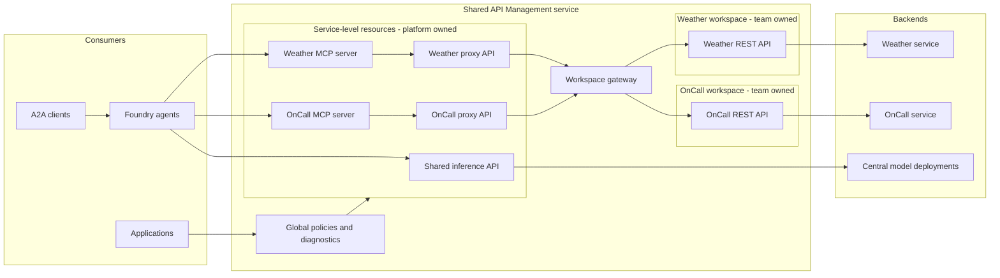

# Architecture and boundaries

## Objective

The architecture allows multiple autonomous teams to operate APIs in isolated API Management workspaces while selected capabilities are published through a centrally governed gateway for use by applications, MCP clients, and agents.

It avoids two common extremes:

- a central platform team becoming the delivery bottleneck for every API change;
- each team deploying an independent gateway with inconsistent security, discovery, and operations.

## Logical architecture

## Control-plane ownership

| Scope | Typical owner | Resources |
| --- | --- | --- |
| Azure landing zone | Cloud platform | subscriptions, policy, networking, private DNS, budgets |
| API Management service | API platform | service SKU, identity, global policy, diagnostics, service-level APIs, products, developer portal |
| Workspace gateway | API platform or delegated gateway operations team | capacity, network integration, workspace associations, health and scaling |
| Workspace | Domain API team | APIs, API operations, workspace policies, products, subscriptions, named values supported in the workspace |
| Backend workload | Domain API team | application, container image, data, application identity, deployment |
| Shared MCP publication | API platform with domain approval | service-level proxy API, selected operations, MCP server, access policy, diagnostics |
| Foundry model gateway | AI platform | shared inference API, model backends, quotas, model policy |
| Agent | Agent or domain team | instructions, tools, evaluations, A2A agent card, release |

Workspace resources cannot reference resources in another workspace. They can reference only supported service-level resources, and some references have security restrictions. Resource names must be unique across the entire API Management service, even when resources are in different workspaces. Establish a naming convention before onboarding teams.

## Data-plane request paths

### Team API request

1. A caller reaches the workspace gateway.
2. Service-level global policy runs.
3. Workspace, product, API, and operation policies run in scope order.
4. The workspace API forwards to the team-owned backend.
5. Telemetry is written using the shared monitoring configuration and team-specific correlation dimensions.

### MCP tool request

1. An MCP client or agent calls `https://<apim-host>/<mcp-path>/mcp`.
2. API Management applies global and MCP-server policies.
3. The MCP server maps the requested tool to an operation on a service-level proxy API.
4. The proxy forwards to the workspace API on its assigned gateway.
5. The workspace API applies team policy and invokes the backend.
6. The response streams back through the proxy and MCP server.

The extra proxy is deliberate. API Management does not currently support MCP server resources inside workspaces, so the service-level MCP server cannot be owned entirely inside the team workspace.

### Agent and A2A request

1. An A2A client reads the agent card and discovers the agent endpoint.
2. The client sends an A2A JSON-RPC message to the agent.
3. The agent uses the centrally provided model-gateway connection for inference.
4. When required, the agent invokes its MCP server.
5. The MCP path reaches the owning team API as described above.

The agent lifecycle and the API/MCP lifecycle are related but independent. An API release must not silently change an agent's expected tool schema, and an agent release must not bypass the API publication controls.

## Gateway deployment choices

The current [main.bicep](../main.bicep) deploys one dedicated workspace gateway and assigns both workspaces to it. The service-level proxies call the unique workspace-gateway hostname.

For production, select one of these patterns explicitly:

| Pattern | Use when | Trade-offs |
| --- | --- | --- |
| Default managed gateway | teams can share service capacity and need the simplest, lowest-cost topology | shared capacity and configuration; less runtime isolation |
| Shared workspace gateway | a group of teams has common network, locality, or isolation requirements | shared failure and capacity domain; additional cost |
| Dedicated gateway per critical workspace | workload isolation, independent scaling, or security boundaries justify it | highest cost and operational overhead |
| Multiple workspace gateways by trust zone | internal, partner, and external APIs need distinct network or policy boundaries | more routing, capacity, and certificate operations |

Workspace gateways currently do not support custom hostnames or inbound private endpoints. A gateway must be in the same subscription and primary region as the API Management service. If a stable custom edge hostname is required, place a governed reverse proxy such as Azure Front Door or Application Gateway in front and validate protocol streaming behavior.

For the complete placement, networking, DNS, subnet, and regional-availability constraints, see [Workspace and gateway technical limitations](workspace-and-gateway-limitations.md).

## Platform boundary for MCP

For an API to be published as an MCP server:

- it must be an HTTP-compatible REST API;
- only selected operations should become tools;
- operation IDs and descriptions must be stable and meaningful to models;
- tools are supported, but MCP resources and prompts are not currently exposed from managed REST APIs;
- MCP server policy must not read `context.Response.Body`, because response buffering can interfere with streaming;
- service-level diagnostics must avoid logging MCP response payloads;
- authentication, authorization, quota, and auditing must be applied at the service-level MCP surface and, where appropriate, again at the workspace API.

## Environment topology

Use separate nonproduction and production API Management services. Workspaces isolate administration inside a service; they are not a substitute for environment isolation.

Recommended minimum:

| Environment | Purpose | Change path |
| --- | --- | --- |
| Development | contract and policy iteration, integration tests | team-owned branch deployments or a development instance |
| Test | integrated workspace, shared proxy, MCP, agent, and backend testing | protected CI/CD |
| Production | consumer traffic | approved promotion of an immutable commit |

Regulated or high-scale organizations can add preview, performance, preproduction, and disaster-recovery environments.

## Lab-to-production differences

The lab uses open endpoints and skeleton backends to make the flow easy to observe. Before production:

- replace permissive CORS with an explicit origin policy;
- require Microsoft Entra ID, subscriptions, or another approved client credential;
- use workload identity federation for pipelines;
- store secret material in an approved secret store;
- use immutable container image digests rather than mutable tags;
- define per-API and per-consumer quotas;
- add contract, policy, security, MCP protocol, and agent evaluation gates;
- define a gateway isolation and capacity strategy;
- establish data classification and payload-logging rules.

## References

- [API Management workspaces](https://learn.microsoft.com/azure/api-management/workspaces-overview)
- [API Management gateway overview](https://learn.microsoft.com/azure/api-management/api-management-gateways-overview)
- [Expose a REST API as an MCP server](https://learn.microsoft.com/azure/api-management/export-rest-mcp-server)
- [Secure access to MCP servers](https://learn.microsoft.com/azure/api-management/secure-mcp-servers)
