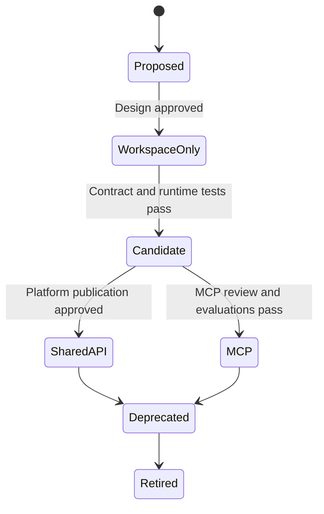

# Onboarding and publishing workflow

This runbook describes how a domain team introduces an API into its workspace and publishes selected operations on the shared gateway.

## Publication states



An API can remain workspace-only permanently. Shared publication is a separate decision, not the automatic result of creating a workspace API.

## 1. Propose the capability

Create an API proposal containing:

- owner and support contact;
- user problem and intended consumers;
- OpenAPI contract;
- data classification;
- authentication and authorization design;
- expected load and service objectives;
- backend connectivity;
- compatibility and deprecation strategy;
- proposed MCP operations, if applicable;
- risk assessment for read, write, destructive, and high-privilege operations.

The platform team checks naming, gateway placement, shared policy compatibility, and duplication. Security reviews the proposal according to organizational thresholds.

## 2. Add the team workspace artifacts

The lab's Weather team is the reference layout:

```text
src/weather/
├── openapi.json
├── api-policy.xml
└── app/
    ├── Dockerfile
    ├── main.py
    └── requirements.txt
```

For production APIOps, keep API Management artifacts in the chosen APIOps-compatible structure rather than coupling every team change to the lab's root Bicep file. The team-owned change contains:

- API specification;
- API information and metadata;
- workspace API policy;
- workspace product and subscription configuration, when applicable;
- tests and examples;
- environment-neutral references.

Backend URLs, resource IDs, and secrets are supplied by reviewed environment configuration. Never commit credentials.

## 3. Validate the workspace API

The pull-request pipeline must:

1. validate OpenAPI syntax;
2. lint API design rules;
3. detect breaking changes against the protected branch;
4. validate APIM policy XML and approved policy usage;
5. scan for secrets and unsafe examples;
6. build and test the backend;
7. deploy to a nonproduction environment;
8. run positive and negative contract tests;
9. verify authentication and authorization;
10. exercise throttling, timeout, retry, and backend-failure behavior;
11. publish test evidence.

Use an API revision for a nonbreaking implementation change that needs validation before it becomes current. Use an API version for a breaking contract change.

## 4. Request shared publication

The domain team submits a publication manifest or pull request that identifies:

- workspace and API resource name;
- approved API version or revision;
- operations to publish;
- public path and display name;
- intended product or consumer group;
- authentication and authorization policy;
- quota and rate-limit requirements;
- MCP server and tool names, if requested;
- tool descriptions and parameter descriptions;
- owners, support route, service objective, and retirement date if temporary.

The platform team verifies that the request references an approved contract commit and a healthy deployed workspace API.

## 5. Publish the service-level proxy

Because workspace APIs cannot currently be selected directly as workspace-hosted MCP servers, the platform pipeline creates a service-level proxy API.

The proxy:

- uses the approved OpenAPI contract;
- exposes only approved operations;
- routes to the workspace API hostname and path;
- preserves or creates a correlation ID;
- uses an approved service-to-service identity or credential;
- does not unintentionally broaden workspace API access;
- applies service-level diagnostics without logging sensitive payloads.

In the lab, [service-mcp.bicep](../src/service-mcp.bicep) creates this proxy and the MCP server together. [proxy-policy.xml](../src/weather/proxy-policy.xml) illustrates the route from the service-level proxy to the workspace API.

## 6. Publish selected operations as MCP tools

For each tool:

- use a stable, unique operation ID;
- use an action-oriented name;
- explain what the tool does and when to use it;
- document required parameters, valid values, units, and error behavior;
- expose the minimum capability needed;
- avoid combining unrelated actions;
- require confirmation or additional authorization for destructive actions;
- define idempotency for writes;
- exclude internal-only fields and operations.

The MCP policy should apply approved identity, authorization, rate limiting, and trace controls. Do not inspect `context.Response.Body` in MCP policy.

Validation must cover:

- MCP initialization and tool discovery;
- JSON schema correctness;
- representative successful calls;
- invalid and unauthorized calls;
- throttling;
- streaming behavior;
- correlation from MCP request to proxy, workspace API, and backend;
- agent evaluations for correct and incorrect tool selection;
- prompt-injection and excess-permission scenarios.

## 7. Connect the agent

The agent team references the approved MCP endpoint, not the team backend directly. It then:

1. pins the expected tool contract or release;
2. defines agent instructions and allowed tool use;
3. runs offline and integration evaluations;
4. verifies shared inference routing and quota behavior;
5. publishes an A2A agent card with accurate skills and ownership;
6. promotes the agent independently while recording the compatible MCP/API release.

## 8. Promote to production

The release pipeline promotes the same approved commit through environments:

1. dry-run the APIOps publication;
2. review creates, updates, deletes, and skipped resources;
3. deploy the workspace configuration;
4. run workspace API smoke tests;
5. deploy the service-level proxy and MCP configuration;
6. run MCP protocol and security tests;
7. run agent evaluations and A2A smoke tests;
8. observe health during the release window;
9. record the APIOps commit, backend release, API revision/version, MCP publication, and agent release as one compatibility set.

## 9. Roll back

Rollback is coordinated across layers:

- restore the previous APIOps configuration or make the previous API revision current;
- restore a compatible backend release;
- restore the previous service-level proxy and MCP tool set;
- restore or disable the affected agent release if its tool assumptions changed.

Reverting only the API Management configuration does not restore an incompatible backend. Keep known-good compatibility sets and test rollback in nonproduction.

## Definition of done

A shared API or MCP server is production-ready when:

- ownership and support are visible;
- contract and policy checks pass;
- authentication and least privilege are verified;
- nonproduction integration tests pass;
- tool and agent evaluations pass when applicable;
- dashboards, alerts, and service objectives exist;
- rollback is documented and tested;
- consumer documentation is published;
- the production state can be reproduced from an approved Git commit.

